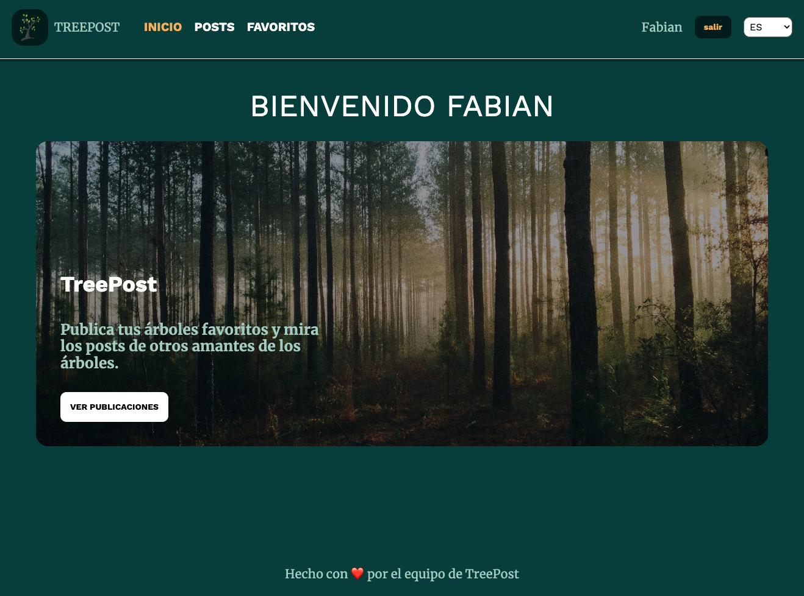

<br />
<div align="center">
  <a href="https://github.com/fabian2299/clever-posts-next">
    
  </a>

<h3 align="center">TREEPOST</h3>

  <p align="center">
    Post your trees and get feedback from other tree lovers. Share your tree
    <br />
    <br />
    <a href="https://clever-posts-next.vercel.app/es">View Demo</a>
    ·
    <a href="https://github.com/fabian2299/clever-posts-next/issues">Report Bug</a>
    ·
    <a href="https://github.com/fabian2299/clever-posts-next/issues">Request Feature</a>
  </p>
</div>


 
 <p align="center">
  
 </p>

### Built With

* [![Next][Next.js]][Next-url]
* [![React][React.js]][React-url]


### Installation

1. Clone the repo
   ```sh
   git clone git@github.com:fabian2299/clever-posts-next.git
   ```
2. Install NPM packages
   ```sh
   npm install
   ```
3. Add env in .env.test.local
   ```sh
    CYPRESS_baseUrl="http://localhost:3000"
    APP_ENV="test"
    CYPRESS_TEST_NAME="test"
    CYPRESS_TEST_USER_EMAIL="test@test.test"
    CYPRESS_TEST_PASSWORD="123456"
   ```


<!-- MARKDOWN LINKS & IMAGES -->
[Next.js]: https://img.shields.io/badge/next.js-000000?style=for-the-badge&logo=nextdotjs&logoColor=white
[Next-url]: https://nextjs.org/
[React.js]: https://img.shields.io/badge/React-20232A?style=for-the-badge&
[React-url]: https://reactjs.org/

